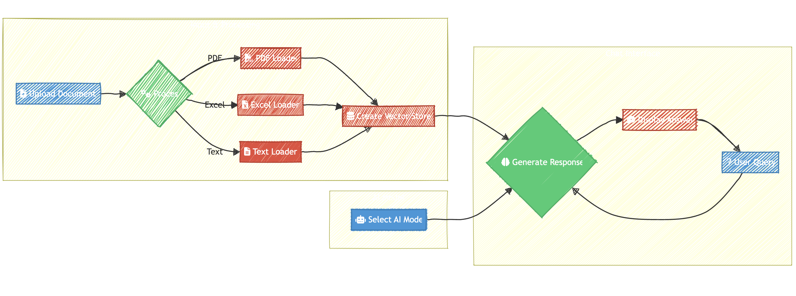

# ☕️ Chat with Any Doc

This Streamlit application allows users to chat with AI and optionally upload documents to chat about their content using OpenAI's language models.

## Screenshot


## Flow chart


## Features

- Chat with AI without document upload
- Support for multiple file types (PDF, TXT, CSV, DOCX, XLSX)
- Integration with OpenAI's GPT models
- Interactive chat interface
- Document processing with LangChain
- Vector storage using FAISS for efficient retrieval
- Customizable system prompt for AI behavior
- Allow user to bring their own OpenAI API Key

## Prerequisites

Before you begin, ensure you have met the following requirements:

- Python 3.11+
- An OpenAI API key

## Installation

1. Clone the repository:
   ```
   git clone https://github.com/yourusername/document-chat-app.git
   cd document-chat-app
   ```

2. Install the required packages:
   ```
   pip install -r requirements.txt
   ```

## Usage

1. Run the Streamlit app:
   ```
   streamlit run app.py
   ```

2. Open your web browser and go to `http://localhost:8501`.

3. Enter your OpenAI API key in the sidebar.

4. Select an AI model from the dropdown in the sidebar.

5. (Optional) Upload a document (PDF, TXT, CSV, DOCX, or XLSX).

6. Start chatting with AI or ask questions about your uploaded document!

7. Use the "Clear Chat" button in the sidebar to reset the conversation.

## Configuration

You can select different OpenAI models from the dropdown in the sidebar. Available models include:

- GPT-4o-Mini
- GPT-4o
- GPT-4o-2024-08-06

## Customization

The AI assistant's behavior is guided by a system prompt, which can be customized in the `app.py` file. The current system prompt is:

## Contributing

Contributions to the Document Chat App are welcome. Please feel free to submit a Pull Request.

## License

This project is licensed under the MIT License - see the [LICENSE.md](LICENSE.md) file for details.

## Acknowledgments

- [Streamlit](https://streamlit.io/) for the web app framework
- [LangChain](https://python.langchain.com/) for document processing and chat functionality
- [OpenAI](https://openai.com/) for the language models and embeddings

